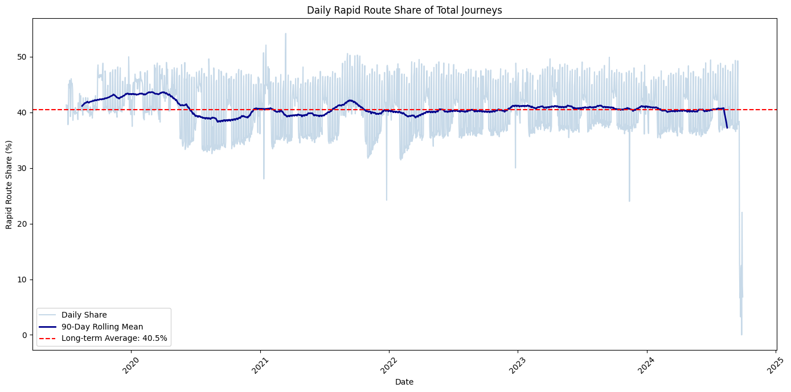
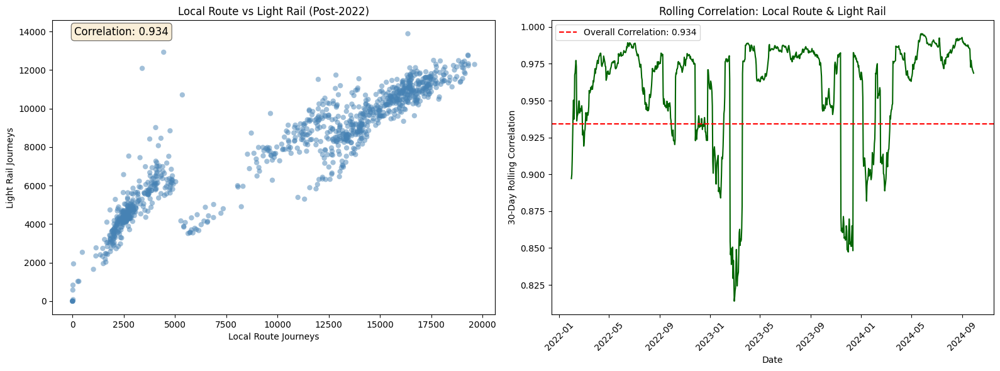
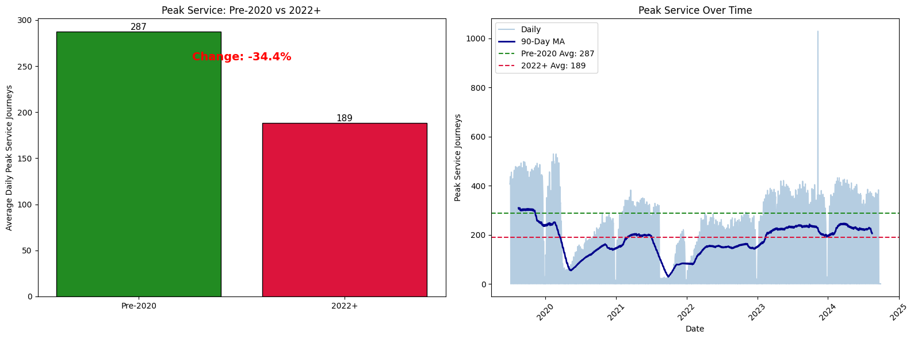

## Analysis Steps

### 1. Load Data
Import the CSV file and display shape, columns, and first rows.  
**Why:** Verify the file loaded correctly and understand the structure.

---

## 2. Data Cleaning
- Drop completely empty rows and duplicates.
- Fill numeric missing values with **median**, categorical with **mode**.
- Convert date-like text columns to datetime format.
- Strip whitespace from text columns.

**Why:** Ensures clean, usable data for analysis without errors from missing or malformed values.

---

## 3. Sort by Date
Sort the dataframe chronologically by the date column.  
**Why:** Time-series analysis requires data in proper date order.

---

## 4. Daily Time Series Plot
Plot all service types (Local Route, Light Rail, Peak Service, Rapid Route, School, Other) over time.  
**Why:** Get a quick visual overview of all trends and patterns.

---

## 5. Monthly Smoothed Plot
Resample to monthly averages, then apply a 3-month rolling mean.  
**Why:** Reduces daily noise to reveal clearer medium-term trends.

---

## 6. Rapid Route Share Analysis
Calculate daily `Rapid Route / Total Journeys %`, apply 90-day moving average, and show long-term average.  
**Why:** Determines if Rapid Routes are the backbone of the system.

---

## 7. Local Route vs Light Rail Correlation (Post-2022)
- Scatter plot showing relationship between the two services.
- 30-day rolling correlation over time.

**Why:** Quantifies how closely these services move together.

---

## 8. Peak Service Decline
Compare average daily Peak Service journeys **before 2020** vs **2022+**, show percentage change, and plot the time series.  
**Why:** Clearly shows the persistent drop in Peak Service after the pandemic.

---

## 9. School Ridership Volatility
- Calculate **Coefficient of Variation (CV = std/mean × 100)** for pre-2020 and 2022+.
- Boxplot per year showing distribution changes.

**Why:** CV measures how variable School journeys are.

---

## 10. Detect Unusual "Other" Spikes
Flag days where `Other > mean + 3×std` and highlight them on the total journeys timeline.  
**Why:** Identifies rare, unusual events (anomalies).

---

## 11. 7-Day Forecast
Fit a **linear regression** on the last 90 days of total journeys and predict the next 7 days.  
**Why:** Provides a simple, interpretable short-term forecast.

---

## Key Insights with Visualizations

### Insight 1: Rapid Route is the Backbone

**Finding:** Rapid Route consistently accounts for approximately **40%** of all daily journeys throughout the entire period. The 90-day moving average stays remarkably stable around this level, even during disruptions. This confirms that Rapid Route is the most critical service type – it carries nearly half of all passengers and forms the backbone of the public transport network.

---

### Insight 2: Local Route and Light Rail Move Together

**Finding:** After 2022, Local Route and Light Rail show a **strong positive correlation** (around 0.9+). The scatter plot reveals a tight linear relationship – when one goes up, the other follows. The rolling correlation stays consistently high over time, meaning this isn't a coincidence but a stable pattern. This suggests both services serve similar commuter populations or are affected by the same external factors (weather, events, holidays).

---

### Insight 3: Peak Service Never Recovered

**Finding:** Peak Service experienced a **dramatic decline** from pre-2020 levels. The bar chart shows the average dropped significantly, and the time series confirms it never bounced back. The 90-day moving average flatlines at the lower level from 2022 onwards. This likely reflects lasting changes in work patterns (remote/hybrid work) that reduced traditional rush-hour commuting demand.

---

### Insight 4: School Ridership Became More Unpredictable

**Finding:** The Coefficient of Variation for School journeys **increased** from pre-2020 to 2022+. The yearly boxplots show wider spreads and more outliers in recent years (red boxes) compared to the stable, compact distributions before 2020 (green boxes). This means school-related transport demand has become harder to predict – possibly due to changing school schedules, remote learning days, or shifting enrollment patterns.

---

### Insight 5: Rare Anomalies in "Other" Category

**Finding:** Using the 3-sigma rule, we detected a small number of days where the "Other" category spiked unusually high. These red markers on the timeline indicate **special events or anomalies** – possibly large public gatherings, festivals, sporting events, or data recording issues. These outliers are rare but significant, and knowing when they occur helps explain sudden jumps in total ridership.

---

## Methods Used

| Method | Purpose |
|--------|---------|
| Median/Mode imputation | Fill missing values robustly |
| Rolling averages (90-day, 30-day) | Smooth noise, reveal trends |
| Coefficient of Variation | Measure relative volatility |
| 3-sigma rule | Simple anomaly detection |
| Linear Regression | Short-term trend forecasting |
---

*This analysis provides a complete picture of public transport usage: which services dominate, how they relate to each other, what changed after 2020, how predictable each service is, and what the near future might look like.*
